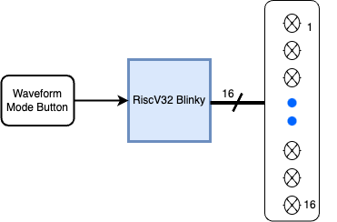
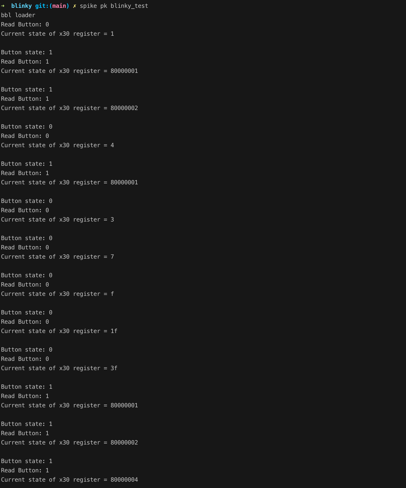

### Blinky IOT
Display a pattern on 16 leds. The pattern changes when the waveform mode button is pressed, which emits a pulse via a external pulse circuit. The code allows only a change in pattern when the button signal goes from low to high. The pattern repeats continuously until the button is pressed or the circuit is reset, then it  begins the pattern again.

#### Block Diagram


#### Blinky Schematic


#### x30 GPIO allocation
Output:

x30[15:0] - 16 display leds: active high

Input:

x30[31] - toggle mode button: pulse length 100ms

#### C code
1. blinky_test.c - app for testing the GPIO x30 registor
1. blinky.c - stripped for verilog generation when not adding the -DTESTGPIO flag to the c compiler

-- blinky test
``` C
#include <stdio.h>
#include <stdlib.h>

// GPIO bits
const int ON = 1;
const int OFF = 0;
const int LED_MASK = 0xFFFF; // Mask for LED bits (x30[15:0])
// Test: set button state (x30[31])
const int BUTTON_ON = 0x80000000;  // x30[31] =1
const int BUTTON_OFF = 0x00000000; // x30[31] =0

// Function prototypes
void setLEDs(int led_pattern);
int readButton();
// test: set button state
void setButton(int GPIO_button_bit);

int main() {
  int button_state = 0;
  int previous_button_state = 0;
  int current_pattern = 0;     // Start with pattern 0
  int current_pattern_set = 0; // Start with pattern set 0
  int i;                       // Loop counter
  int seconds = 1;             // Delay time
  // test
  int x30_value = 0x00000000;
  int set_button_state = 0;

  int patterns_set1[] = {0x0001, 0x0003, 0x0007, 0x000F,
                         0x001F, 0x003F, 0x007F, 0x00FF};
  int patterns_set2[] = {0x0001, 0x0002, 0x0004, 0x0008,
                         0x0016, 0x0032, 0x007F, 0x00FF};
  int *current_patterns = patterns_set1; // Start with patterns_set1

  while (1) {
    button_state = readButton();
    // Test: Read the current value of x30 register (button state)
    printf("Read Button: %d\n", button_state);

    // Check for low-to-high transition
    if (button_state == ON && previous_button_state == OFF) {
      // Button pressed, change pattern set
      current_pattern_set =
          (current_pattern_set + 1) % 2; // Toggle between 0 and 1
      current_patterns =
          (current_pattern_set == 0) ? patterns_set1 : patterns_set2;
      current_pattern = 0; // Reset pattern index within the set
    }

    previous_button_state = button_state;

    setLEDs(current_patterns[current_pattern]);
    // Test: Read the current value of x30 register (LED pattern)
    asm volatile("addi %0, x30, 0\n\t" : "=r"(x30_value) : :); // read x30
    printf("Current state of x30 register = %x\n\n", x30_value);

    current_pattern = (current_pattern + 1) %
                      (sizeof(current_patterns)); // Advance pattern index

    // Delay to control pattern speed
    for (i = 0; i < seconds * 1000000; i++) {
      asm volatile("nop");
    }

    // Test: Randomly set the button state (x30[31])
    set_button_state = random() % 2;
    printf("Button state: %d\n", set_button_state);
    if (set_button_state == 1) {
      setButton(BUTTON_ON);
    } else {
      setButton(BUTTON_OFF);
    }
  }

  return 0;
}

// Function definitions =====================================================

void setLEDs(int led_pattern) {
  int mask = 0xFFFF0000; // preserve all bits except x30[0] - set to 0
  asm volatile("and x30,x30, %1\n\t"
               "or x30,x30, %0\n\t"
               :
               : "r"(led_pattern), "r"(mask)
               : "x30" // clobber list,indicating that x30 is modified
  );
}

int readButton() {
  int button_press; // read whether it is pressed or not
  asm volatile("srli x10, x30, 31\n\t"
               "andi %0, x10, 1\n\t"
               : "=r"(button_press)
               :
               : "x10");
  return button_press;
}

// Test: Set the button state
void setButton(int GPIO_button_bit) {
  int mask = 0x7FFFFFFF; // preserve all bits except x30[31] - set to 0
  asm volatile("and x30,x30, %1\n\t"
               "or x30,x30, %0\n\t"
               :
               : "r"(GPIO_button_bit), "r"(mask)
               : "x30" // clobber list,indicating that x30 is modified
  );
}

```
-- blinky for verilog, does not pass -DTESTGPIO to c compiler removing all testing code with "#ifdef TESTGPIO"
``` C
#ifdef TESTGPIO
#include <stdio.h>
#include <stdlib.h>
#endif

// GPIO bits
const int ON = 1;
const int OFF = 0;
const int LED_MASK = 0xFFFF; // Mask for LED bits (x30[15:0])

#ifdef TESTGPIO
// Test: set button state (x30[31])
const int BUTTON_ON = 0x80000000;  // x30[31] =1
const int BUTTON_OFF = 0x00000000; // x30[31] =0
#endif

// Function prototypes
void setLEDs(int led_pattern);
int readButton();
#ifdef TESTGPIO
// test: set button state
void setButton(int GPIO_button_bit);
#endif

int main() {
  int button_state = 0;
  int previous_button_state = 0;
  int current_pattern = 0;     // Start with pattern 0
  int current_pattern_set = 0; // Start with pattern set 0
  int i;                       // Loop counter
  int seconds = 1;             // Delay time
#ifdef TESTGPIO
  // test
  int x30_value = 0x00000000;
  int set_button_state = 0;
#endif

  int patterns_set1[] = {0x0001, 0x0003, 0x0007, 0x000F,
                         0x001F, 0x003F, 0x007F, 0x00FF};
  int patterns_set2[] = {0x0001, 0x0002, 0x0004, 0x0008,
                         0x0016, 0x0032, 0x007F, 0x00FF};
  int *current_patterns = patterns_set1; // Start with patterns_set1

  while (1) {
    button_state = readButton();
#ifdef TESTGPIO
    // Test: Read the current value of x30 register (button state)
    printf("Read Button: %d\n", button_state);
#endif

    // Check for low-to-high transition
    if (button_state == ON && previous_button_state == OFF) {
      // Button pressed, change pattern set
      current_pattern_set =
          (current_pattern_set + 1) % 2; // Toggle between 0 and 1
      current_patterns =
          (current_pattern_set == 0) ? patterns_set1 : patterns_set2;
      current_pattercn = 0; // Reset pattern index within the set
    }

    previous_button_state = button_state;

    setLEDs(current_patterns[current_pattern]);
#ifdef TESTGPIO
    // Test: Read the current value of x30 register (LED pattern)
    asm volatile("addi %0, x30, 0\n\t" : "=r"(x30_value) : :); // read x30
    printf("Current state of x30 register = %x\n\n", x30_value);
#endif

    current_pattern = (current_pattern + 1) %
                      (sizeof(current_patterns)); // Advance pattern index

    // Delay to control pattern speed
    for (i = 0; i < seconds * 1000000; i++) {
      asm volatile("nop");
    }

#ifdef TESTGPIO
    // Test: Randomly set the button state (x30[31])
    set_button_state = random() % 2;
    printf("Button state: %d\n", set_button_state);
    if (set_button_state == 1) {
      setButton(BUTTON_ON);
    } else {
      setButton(BUTTON_OFF);
    }
#endif
  }

  return 0;
}

// Function definitions =====================================================

void setLEDs(int led_pattern) {
  int mask =
      0xFFFF0000; // preserve all bits except lower 16 bits x30[15:0] - set to 0
  asm volatile("and x30,x30, %1\n\t" // "and" with mask will clear lower 16 bits
                                     // so that the "or" instruction will work
                                     // correctly with the new pattern
               "or x30,x30, %0\n\t"  // "or" with the new pattern will and any
                                     // bits that are 1
               :
               : "r"(led_pattern), "r"(mask)
               : "x30" // clobber list,indicating that x30 is modified
  );
}

int readButton() {
  int button_press; // read whether it is pressed or not
  // Read the current value of x30 register (button state) without modifying x30
  asm volatile(
      "srli x10, x30, 31\n\t" // shift right logical x30 by 31 bits
                              // (x30[31] will be in x10[0])
      "andi %0, x10, 1\n\t"   // "and" with 1 to get the value of x30[31] now in
                              // x10[0] x10[0] will be 1 if x30[31] is 1
      : "=r"(button_press)
      :
      : "x10");
  return button_press;
}

#ifdef TESTGPIO
// Test: Set the button state
void setButton(int GPIO_button_bit) {
  int mask = 0x7FFFFFFF; // preserve all bits except x30[31] - set to 0
  asm volatile("and x30,x30, %1\n\t"
               "or x30,x30, %0\n\t"
               :
               : "r"(GPIO_button_bit), "r"(mask)
               : "x30" // clobber list,indicating that x30 is modified
  );
}
#endif
 
```
#### Instructions used
```
Number of different instructions: 19
List of unique instructions:
and
sra
lw
sub
jal
bne
sw
blt
mv
srl
j
li
nop
add
or
ret
sll
bnez
lui
```
#### Testing app via x30 GPIO bits 

